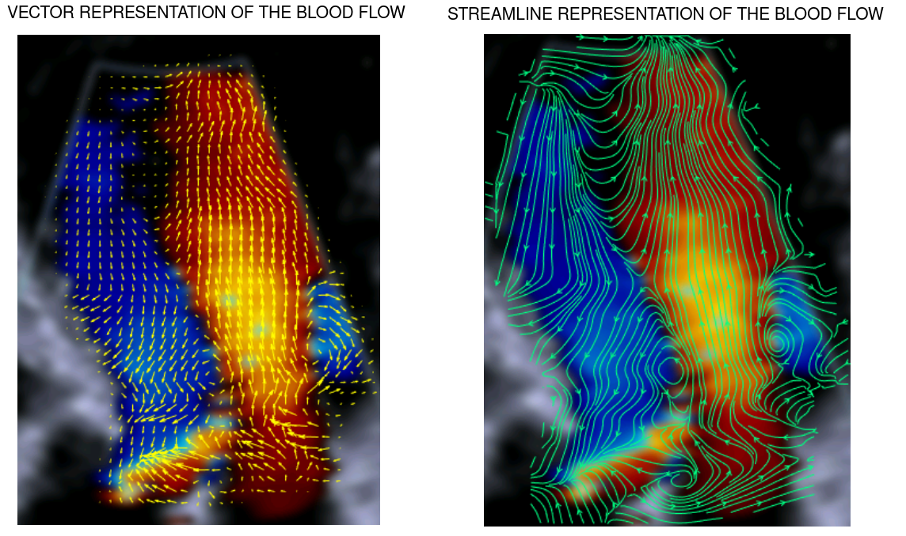

# Blood-Flow-Visualization
Vector Flow Mapping technique can be used to detect the vortices formed in the left ventricle. By tracking the duration of the vortices, one can evaluate the functionality of the heart. (Vortices tend to stay for a longer duration in an abnormal heart).  

## App ##
## Input ##
* Video file (Color Dopple Echocardiography of the heart)
* Draw a box over the left ventricle and mark the location of the beam
* Draw a box over the colorbar and give compute
## Output ##
* Video/Frame with the Streamlines/Vectors over the frame
## Features ##
* Density of vectors and streamlines can be changed
* Length of the vectors can be changed
* Color of the vectors and the streamlines can be changed
* View the streamlines/vectors frame by frame
* View the streamlines/vectors in a video with the pause/resume option
* The video speed can be increased or decreased by clicking "Slow" or "Fast" button
(These features help in aiding the blood flow visualization)

